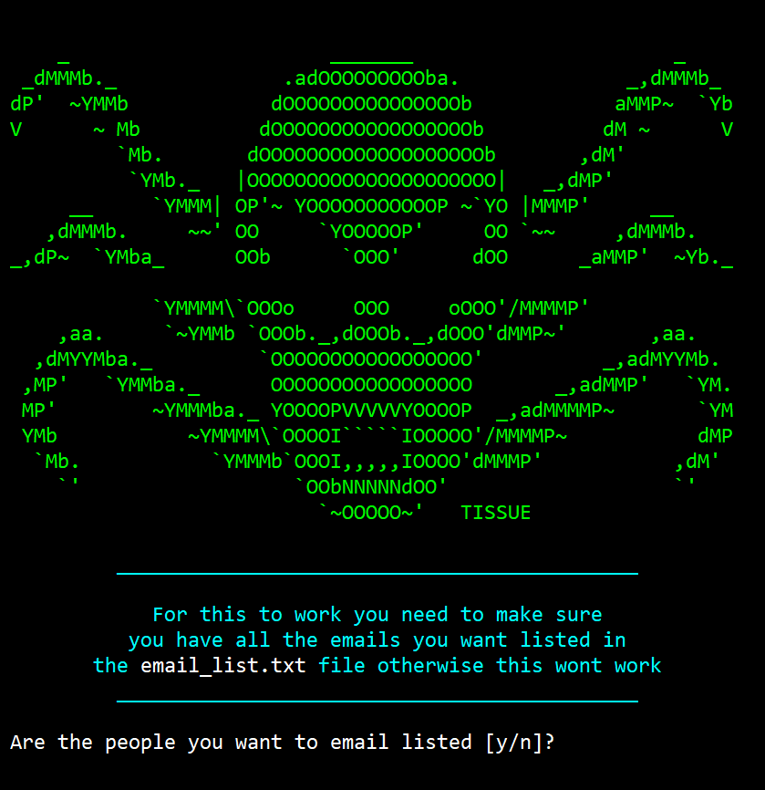

# Email_Spammer

## Installation

- This is a simple terminal program. All you have to do is download the code, 
  navigate to the directory the code is in and run the command 'py main.py'
  and it will run the program.

- Make sure you have python installed on your computer otherwise you can't run the program.

- You'll also more than likely have pip install rich.

- Make sure to turn on 2 Factor Authentication on whatever email client you're using. 
  Then create an app password and when the program asks for the password use the app password.

## Run
As far as the program works it's got a nice API, fairly dummy proof, just follow the steps on screen.
I would recommend using a gmail account at first if you're unfamiliar with how emailers work.

## Capabilities

- Email One person or Import a list of emails
- Can send multiple emails on both the single email option and multi email option
- Will allow you to send files
- Looks sick with [rich](https://github.com/Textualize/rich) as well as some ASll art
- Allows you to spoof your name

## Educational Use Only

This is purely for education purposes only, the author
won't be held liable for anything the user does

## Author

- [@rbeavs](https://www.github.com/rbeavs)
